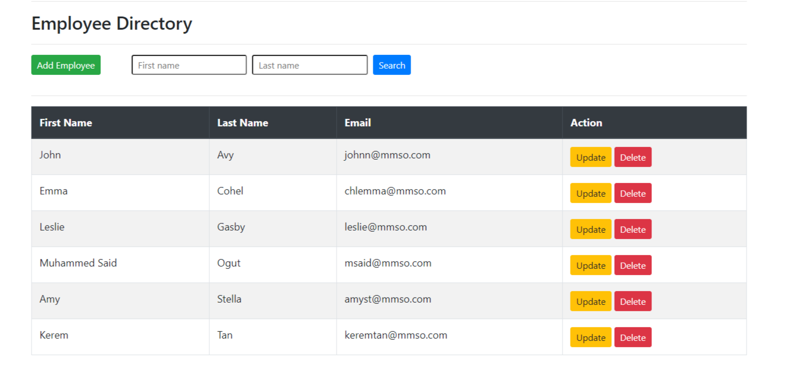
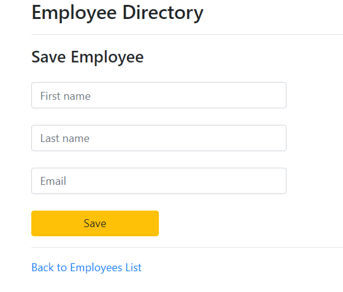
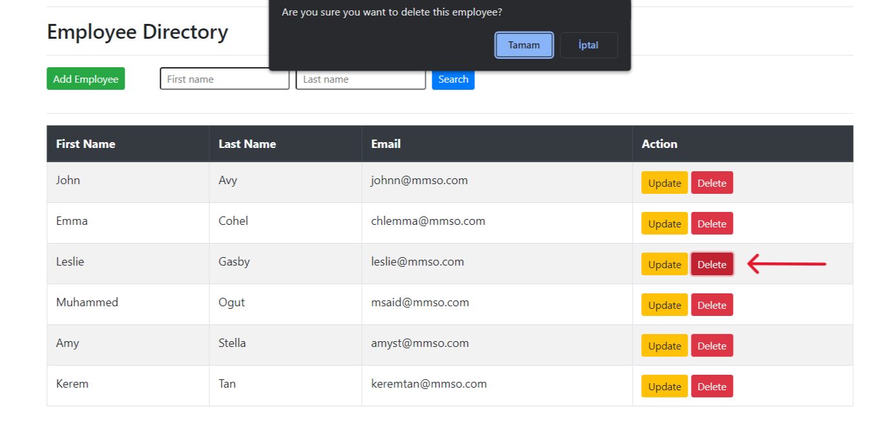
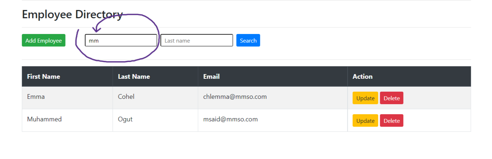

# Spring Boot MVC with Thymeleaf

## Employees' List

## Save & Update Employee

(If you click update button, Employee's informations will be loaded automatically)

## Delete Employee

## Search Employee

